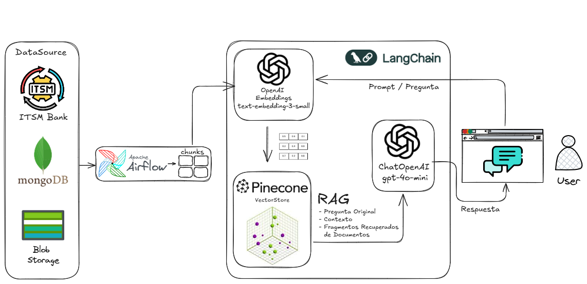
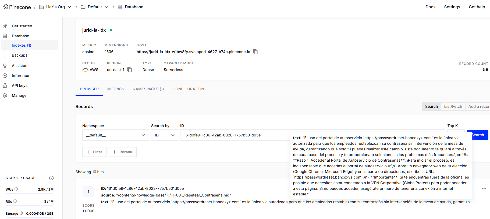

<!DOCTYPE html>
<html lang="es">

<body>
    <h1>⚖️ Jurid-IA: Asistente Jurídico Inteligente</h1>
    
Una solución de IA para resolver problemas de negocio, optimizando la productividad del área jurídica en el Banco XYZ.

    

        
        
<em>Demostración de la interfaz de Jurid-IA en acción.</em>

    

    <h2>Descripción del Proyecto</h2>
    

        <strong>Jurid-IA</strong> es un asistente de inteligencia artificial diseñado para actuar como un punto único de acceso al vasto conocimiento organizacional del Banco XYZ. Esta solución aborda un desafío crítico en el área jurídica: la necesidad de consultar rápidamente extensos volúmenes de documentos, como contratos, reglamentos internos y políticas, además de resolver dudas ofimáticas comunes que generaban largos tiempos de espera con el soporte de TI.
    

    

        <h3>El Problema de Negocio</h3>
        

            El área jurídica del <strong>Banco XYZ</strong> enfrentaba dos grandes cuellos de botella en su productividad:
        

        <ul>
            <li><strong>Consulta Documental Ineficiente:</strong> Los abogados y analistas debían invertir una cantidad considerable de tiempo en la lectura y búsqueda de información específica dentro de documentos largos y complejos.</li>
            <li><strong>Alta Dependencia de TI:</strong> Para resolver incidentes menores de ofimática, el equipo debía generar tickets y esperar el cumplimiento de SLAs de varios días, interrumpiendo su flujo de trabajo.</li>
        </ul>
        

            Como resultado, se desarrolló <strong>Jurid-IA</strong>, un chatbot de IA entrenado a medida con todos los documentos relevantes. El impacto fue directo: <strong>un aumento del 40% en la productividad del área</strong>, transformando su manera de trabajar.
        

    

    <h2>Arquitectura de la Solución</h2>
    

        La solución se fundamenta en una arquitectura moderna de <strong>Generación Aumentada por Recuperación (RAG)</strong>, orquestada con el framework <strong>LangChain</strong> para garantizar un flujo de datos coherente y eficiente.
    

    
    
El flujo de trabajo es el siguiente:

    <ol>
        <li><strong>Fuentes de Datos (Data Sources):</strong> La información se extrae de diversas fuentes como <strong>ITSM Bank</strong>, <strong>MongoDB</strong> y <strong>Blob Storage</strong>.</li>
        <li><strong>ETL con Apache Airflow:</strong> Un pipeline automatizado con Airflow se encarga de extraer, transformar y cargar (ETL) los documentos. Estos se procesan y dividen en fragmentos manejables (<em>chunks</em>).</li>
        <li><strong>Generación de Embeddings:</strong> Los chunks de texto son procesados por el modelo <code>text-embedding-3-small</code> de OpenAI para convertirlos en vectores numéricos (embeddings).</li>
        <li><strong>Base de Datos Vectorial (Vector Store):</strong> Los embeddings se almacenan y se indexan en <strong>Pinecone</strong>, una base de datos vectorial optimizada para búsquedas de similitud semántica a alta velocidad.</li>
      
        <li><strong>Interfaz de Usuario (Gradio):</strong> El usuario final interactúa con un chatbot a través de una interfaz web creada con <strong>Gradio</strong>.</li>
        <li><strong>Proceso RAG:</strong>
            <ul>
                <li>Cuando un usuario envía una pregunta, LangChain la utiliza para consultar el índice de Pinecone.</li>
                <li>Pinecone devuelve los fragmentos de documentos más relevantes semánticamente (el "contexto").</li>
                <li>El prompt final, que incluye la pregunta original y el contexto recuperado, se envía al modelo de lenguaje <code>gpt-4o-mini</code> de OpenAI.</li>
            </ul>
        </li>
        <li><strong>Respuesta:</strong> El LLM genera una respuesta precisa y contextualizada, que se muestra al usuario en la interfaz de chat.</li>
    </ol>
    <h2>Stack Tecnológico</h2>
    <ul>
        <li><strong>Orquestación de IA:</strong> LangChain</li>
        <li><strong>Modelos de Lenguaje (LLM):</strong> OpenAI GPT-4o-mini, Text-embedding-3-small</li>
        <li><strong>Base de Datos Vectorial:</strong> Pinecone</li>
        <li><strong>Pipeline de Datos (ETL):</strong> Apache Airflow</li>
        <li><strong>Interfaz de Usuario:</strong> Gradio</li>
        <li><strong>Lenguaje de Programación:</strong> Python</li>
        <li><strong>Fuentes de Datos:</strong> MongoDB, Blob Storage, ITSM</li>
    </ul>
   
   

</body>
</html>
